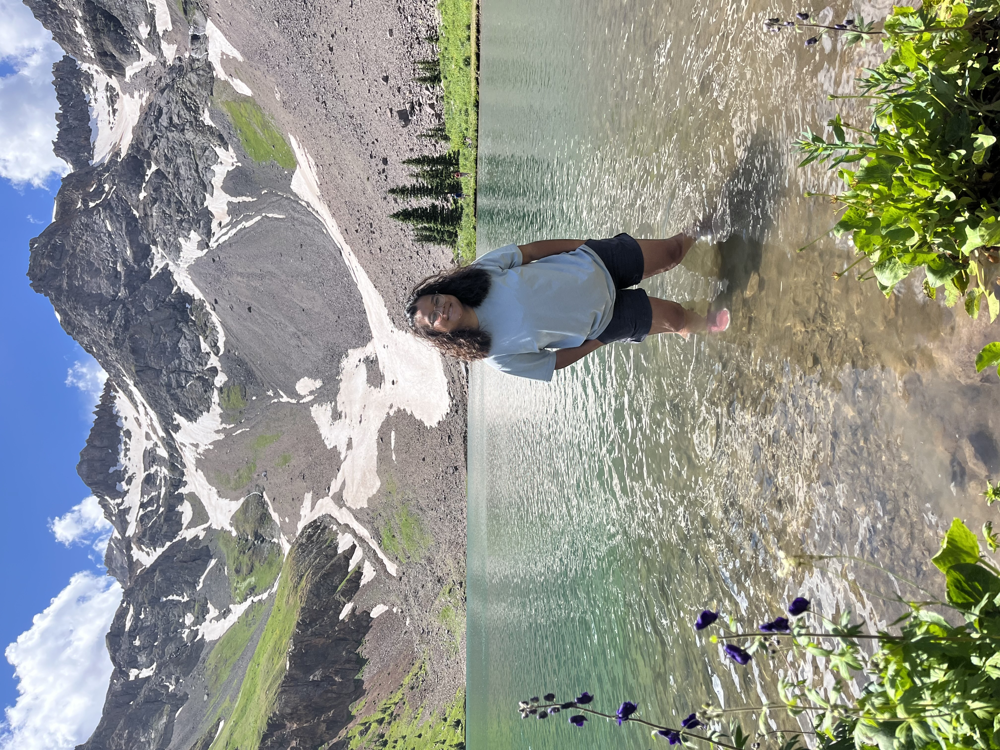

## Paw Moo

### A Little About Me
Hi! I am a student at MSU Denver with a major in environmental science and a minor in biology. I am a 2024 ESIIL Stars student. I am passionate about plants and hope to work in a field of conservation or restoration. My interest in earth science stem from my indigenous/ethnic [Knyaw](https://www.theurbanvillage.org/karenhistory) background. The Knyaw people have always used plants for their medicinal properties and believed in protecting the land their ancestors lived off. I hope to continue my people's legacy of being stewards of the environment. 

#### Contact Information
* Email: pmoo1atmsudenver.edu
* [GitHub](https://PawHEKMoo.github.io)

#### Educational Background
Metropolitan State University of Denver (class of 2024)
  * Major: Environmental Science B.S. 
    * Minor: Biology

#### Map of MSUD
<embed type="text/html" src="img/auraria.html" width="600" height="600">

### ESIIL Stars Projects
Check out my first ESIIL assignment! <a href= "https://PawHEKMoo.github.io/notebooks/get-started-with-open-reproducible-science.html"> Reproducible Climate Analysis </a>

Check out my second ESIIL assignment! <a href= "https://PawHEKMoo.github.io/notebooks/species-distribution.html"> Mapping Western Meadowlark Migration </a>

* Here is an interactive map <a href= "https://PawHEKMoo.github.io/notebooks/migration.html"> Western Meadowlark (Tasiyagnunpa) Migration! </a>

Check out my third ESIIL assignment that explores the NDVI before and after the Cameron Peak Fire. <a href= "https://PawHEKMoo.github.io/notebooks/vegetation.html"> Cameron Peak Fire </a>
